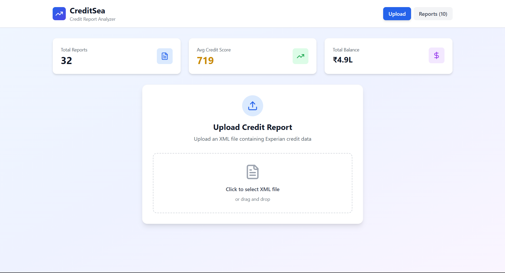
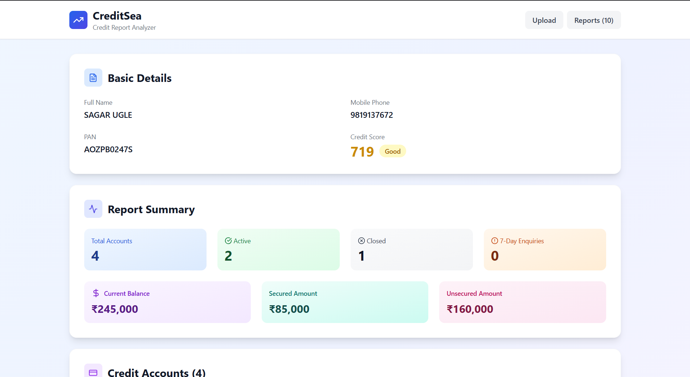
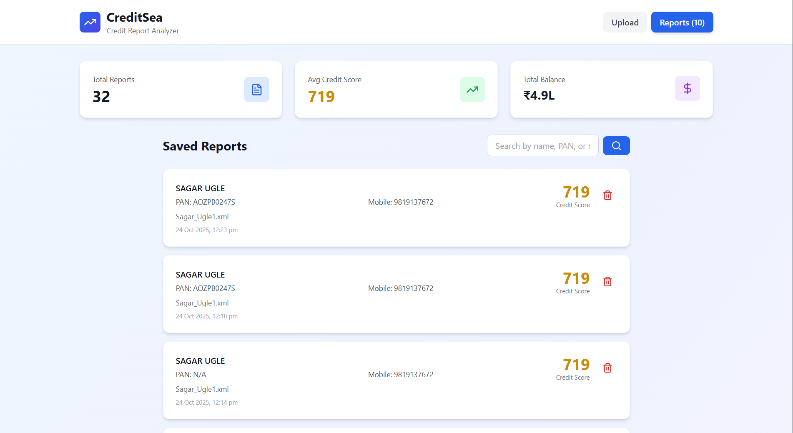
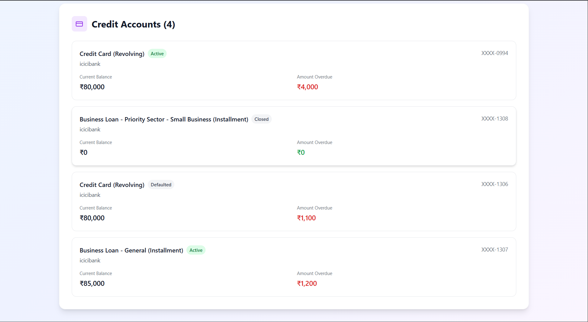

# Credit Report Analyzer

## 🚀 Features

---

- Uploader - To upload XML files for parsing and the statistics on the data 


- Dashboard - Analysis of Uploaded XML file


- Reports - All reports added to application


- Credit Accounts of the user


---

---

## ⚙️ Tech Stack

**Frontend:**
- React.js
- Axios
- React Router
- Tailwind

**Backend:**
- Node.js
- Express.js
- MongoDB (Mongoose)

---

## 🧩 Setup Instructions

### 1️⃣ Clone the Repository
```bash
git clone https://github.com/AshutoshKumar0206/CreditReportAnalyzer.git
cd CreditReportAnalyzer

```bash
cd backend
npm install
node app.js

```bash
cd frontend
npm install
npm start